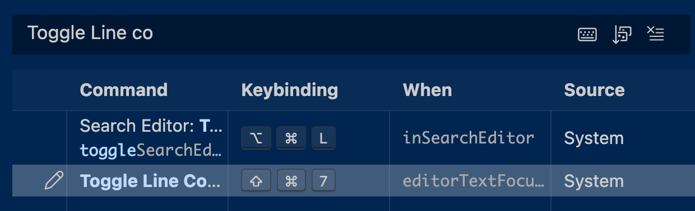

# 1. INTRODUCCIÓN A R Y POSITRON

Imparte: Leonardo Collado Torres 
Fecha: 11-feb-2025 

### R: entorno de análisis estadístico 

> R es un lenguaje de programación y entorno para computación estadística 

>Es un software libre y se distribuye a través de CRAN (Comprehensive R Archive Network)

Links de materiales que permiten explorar que se puede hacer con R:
- 
	 R Bloggers [https://www.r-bloggers.com/](https://www.r-bloggers.com/)
    - TidyTuesday [https://bsky.app/search?q=%23TidyTuesday](https://bsky.app/search?q=%23TidyTuesday)
    - R Weekly [https://rweekly.org/](https://rweekly.org/)


R es particularmente importante en bioinformática debido a

- El ecosistema **Bioconductor**, que provee paquetes especializados para:
    - RNA-seq
    - Microarrays
    - Genómica comparativa
    - Epigenómica
    - Single-cell analysis

### Git y GitHub

Github: plataforma que hospeda repositorios Git y permite compartir código, colaborar en proyectos, documentar análisis, publicar sitios web estáticos (GitHub Pages), etc. 


Git es un **sistema de control de versiones distribuido** que permite:

	Registrar cambios en archivos
	Mantener historial completo del proyecto
    Recuperar versiones previas
	Trabajar de manera colaborativa

Comandos de manejo básicos: 

- `git add` → prepara archivos para registro
- `git commit` → guarda cambios en el historial
- `git push` → envía cambios al repositorio remoto
- `git pull` → actualiza repositorio local


### IDEs: RStudio y Positron

Positron es un entorno de desarrollo integrado (IDE) gratuito desarrollado por Posit.  

>Puede descargarse desde: [https://positron.posit.co/download.html](https://positron.posit.co/download.html).

Características principales:

- Integración con múltiples lenguajes (R, Python, etc.)
- Mejor manejo de extensiones
- Compatibilidad con herramientas de IA (chatbot)

En esta sesión se realizó la instalación en macOS y se verificó:

- Reconocimiento correcto de R
- Acceso a terminal integrada
- Configuración básica del entorno
- Configuración con Github y Chatbot 


###  Repositorio de notas para el curso


```R
# Crea un nuevo proyecto en la ruta absoluta o relativa que le proporciones
usethis::create_project("~/Desktop/rnaseq_2026_notas")
```

Esto genera:

- Carpeta raíz
- Estructura básica
- Proyecto inicializable con Git

Para la creación de scripts dentro del proyecto: 

```R
# Start a setup file
#Es importante numerar los archivos para que el README sea mas simple de actualizar 

usethis::use_r("01-notas.R")
```


Nota: En positron existe una lista de comandos para llevar a cabo diferentes acciones (shortcuts)

> En este caso, con el shortcut que se muestra en la imagen se marcan como comentario todas las lineas seleccionadas. 



### GitHub Education y conexión con Positron

Configuración de  acceso a **GitHub Pro** a través del programa educativo de GitHub y habilitar GitHub Copilot dentro de **Positron**.

Para poder llevar a cabo la configuración, se siguieron los pasos descritos en el manual oficial:

> https://positron.posit.co/assistant-getting-started.html


### Uso de Copilot desde R

Además del autocompletado integrado, es posible interactuar con Copilot vía paquetes en R.

**Paquete `chattr`**

> Permite usar Copilot como chat interactivo dentro de R:

```R
chattr::chattr_app()
```

Además de Copilot, se revisó la posibilidad de usar modelos de lenguaje directamente desde R.

**Paquete `ellmer`**

Instalación:

```r
install.packages("ellmer")
```

En caso de errores en versión estable:

```r
remotes::install_github("tidyverse/ellmer")

```

Uso básico:

```r 
#Permite consultas interactivas dentro de la consola.
library("ellmer")
chat <- chat_github()
live_console(chat)

```

**Automatización con `chores`**

Este paquete permite tareas más estructuradas, como:

- Generación de documentación (roxygen)
- Mejora de funciones
- Manejo de errores

Ejemplo 

```r 
`helper_roxygen <- .init_helper("roxygen") helper_roxygen$chat("foo <- function(x) { print(x) }")`

```


**Acceso al material del curso
 
 > Clonar con Git

```R
git clone https://github.com/lcolladotor/rnaseq_LCG-UNAM_2026.git
```


