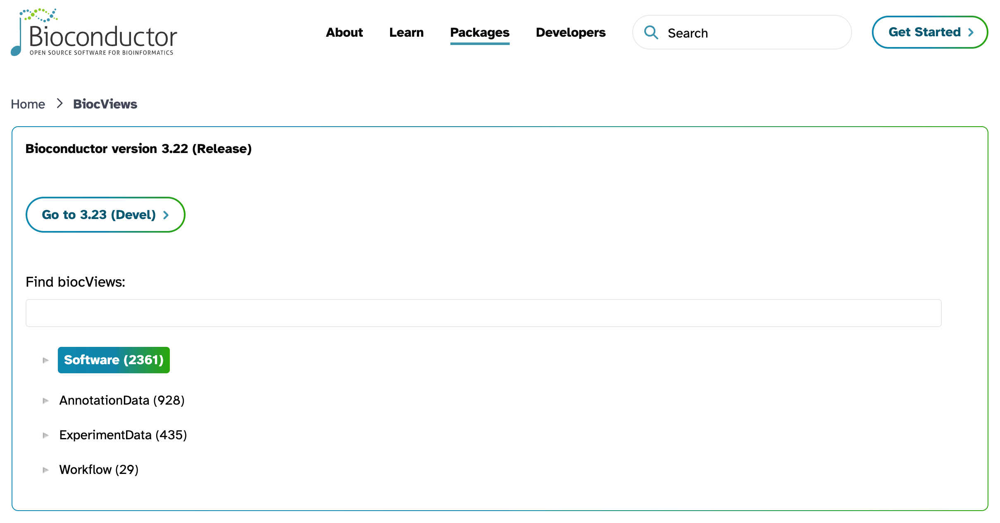
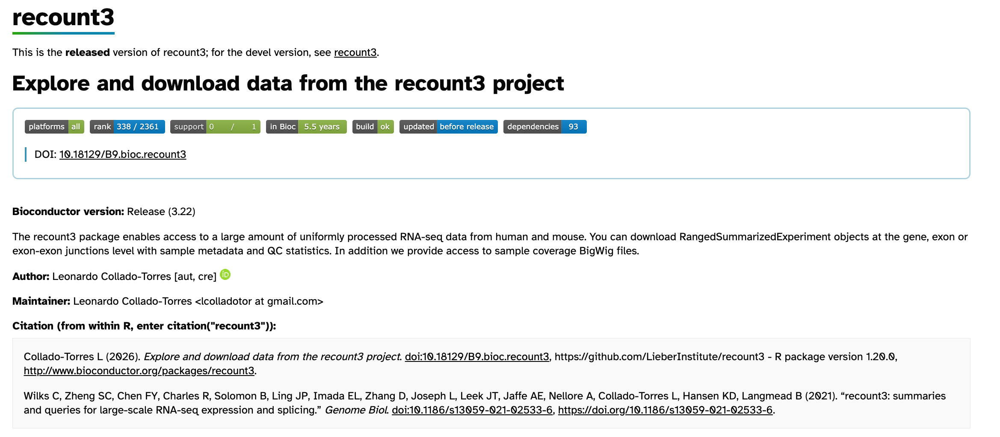
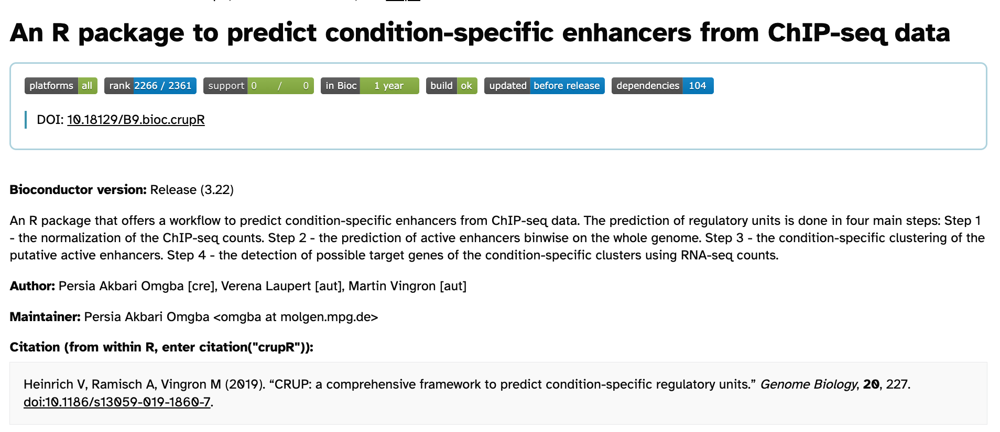

# 2. INTRODUCCIÓN A BIOCONDUCTOR
Fecha: 12-Febrero-2026

**Materiales de referencia:**

> Bioconductor, the R package repository for the “analysis and comprehension of high-throughput genomic data” [http://bioconductor.org/](http://bioconductor.org/)

> - Blog post que escribí en 2014: Where do I start using Bioconductor? 
> - [http://lcolladotor.github.io/2014/10/16/startbioc/#.XqxNGRNKiuo](http://lcolladotor.github.io/2014/10/16/startbioc/#.XqxNGRNKiuo)

> - Sobre Bioconductor: [http://bioconductor.org/about/](http://bioconductor.org/about/)

> Articulo principal de publicacion:- 2015 artículo: [http://www.nature.com/nmeth/journal/v12/n2/abs/nmeth.3252.html](http://www.nature.com/nmeth/journal/v12/n2/abs/nmeth.3252.html)

----

#### ¿QUÉ ES BIOCONDUCTOR?

Bioconductor es un proyecto open-source basado en R, enfocado en el análisis y comprensión de datos biológicos, centrado en particular en bioinformatica y biologia computacional (high-throughput genomic data).

Fue creado por:

> Robert Gentleman  
	(co-creador de R y fundador de Bioconductor)

Bioconductor se construye sobre R y CRAN, pero tiene un enfoque especializado en datos biológicos.

---

#### RELACION ENTRE CRAN Y BIOCONDUCTOR 

CRAN : repositorio principal de paquetes de R.

Bioconductor funciona como:

- Un repositorio especializado
- Con reglas de calidad más estrictas
- Orientado a datos biológicos y ómicos

**Diferencias principales :**

| CRAN                          | Bioconductor                                         |
| ----------------------------- | ---------------------------------------------------- |
| Paquetes generales            | Paquetes especializados en genómica                  |
| Ciclo de publicación flexible | Ciclo sincronizado con versiones de R                |
| Menos requisitos biológicos   | Estándares estrictos para objetos y reproducibilidad |
Bioconductor se construye sobre R y CRAN, pero agregando:

- Estándares estrictos de interoperabilidad    
- Clases S4 comunes
- Testing obligatorio en macOS, Windows y Linux
---

#### PAQUETES DE BIOCONDUCTOR 

Bioconductor clasifica los paquetes en cuatro categorias:

1. Software packages  
	Funciones y métodos
	Son desarrollados principalmente por la comunidad académica.
    Algunos son desarrollados por personal financiado directamente por Bioconductor.
    Ejemplos: Análisis de expresión diferencial, normalización, visualización, clustering, modelado estadístico 

    
2. Annotation packages  
    Información de anotación (genes, transcriptos, SNPs)
    
3. Experimental data packages  
	Datos asociados a un artículo
    Datos de ejemplo para reproducibilidad
    
    
4. Workflows
	Documentos extensos reproducibles
	Integraciones de múltiples paquetes
    Guías paso a paso para un tipo de análisis
	demuestran como puedes usar varios paquetes de Bioconductor para ciertos tipos de análisis
    

Además ofrece:
- Contenedores Docker
- Integración con AnVIL (infraestructura en la nube)


#### biocViews

> [http://bioconductor.org/packages/release/BiocViews.html#___Software](http://bioconductor.org/packages/release/BiocViews.html#___Software)

sistema de metadatos jerárquico tipo árbol que clasifica a los paquetes disponibles en cada una de las releases.



Estructura:

4 árboles principales:

- Software
- Annotation
- ExperimentData
- Workflow

#### Estructura de un paquete de BioC
Para cualquier paquete, la estructura pública se consulta en:

> https://bioconductor.org/packages/<pkg_name>

##### Badges (etiquetas)

Son indicadores rápidos del estado del paquete, permiten evaluar:

- Si compila correctamente
- Build: Si pasa las pruebas que se han aplicado al paquete 
- Platforms: En qué sistemas operativos funciona
- Si está en release o devel

##### DOCUMENTACION 

Cada paquete tiene una sección Documentation que incluye:

- Vignettes (PDF o HTML)
- Manual de referencia

==Las VIGNETTES corresponden a la principal documentación de un paquete, son  un documento largo donde los autores explican cómo usar el paquete, muestran el flujo lógico de funciones e incluyen ejemplos reproducibles.

Campos importantes:

- Depends → paquetes que se cargan automáticamente
- Imports → paquetes usados internamente
- Suggests → paquetes opcionales
- LinkingTo → usado para integración en C/C++
- DependsOnMe → qué paquetes dependen de este

### BugReports

Enlace para
- Reportar errores
- Solicitar soporte
- Abrir issues


¿COMO INSTALAR UN PAQUETE? 

La instalación se realiza siempre usando:

```R
if (!require("BiocManager", quietly = TRUE))
    install.packages("BiocManager")

BiocManager::install("package_name")
```

No se recomienda  el uso `install.packages()` porque:

- Bioconductor está sincronizado con versiones específicas de R.
- Maneja dependencias internas del ecosistema.
- Garantiza compatibilidad con la versión release actual.

###  Release vs Devel

Bioconductor mantiene dos ramas para garantizar estabilidad y reproducibilidad:

- **release** (estable)
- **devel** (desarrollo)

Características:

- Actualización cada 6 meses (abril y octubre).
- Sincronización con versión anual de R.
- Testing obligatorio en 3 sistemas operativos.
- Reportes públicos de checkResults.


### EJEMPLO DE PAQUETE

#### **RECOUNT3** 

>The recount3 package enables access to a large amount of uniformly processed RNA-seq data from human and mouse. You can download RangedSummarizedExperiment objects at the gene, exon or exon-exon junctions level with sample metadata and QC statistics. In addition we provide access to sample coverage BigWig files.


Instalación del paquete

```R
if (!require("BiocManager", quietly = TRUE))
    install.packages("BiocManager")

BiocManager::install("recount")

```




**Secciones importantes :**

1. Platforms
	Indica en qué sistemas operativos funciona:
	- macOS
	- Windows
	- Linux
2. Build
	Se refiere al sistema automático de pruebas que ejecuta Bioconductor.
		Como en este caso indica "OK" sabemos que es un paquete estable 
3. Support
	Indica el número de preguntas asociadas al paquete en el foro oficial de bioconductor en los últimos 6 meses.
4. Dependencies
	Lista de paquetes necesarios para ejecución.


### Otros paquetes 

| Paquete                                                                                          | maintainer       | Title                                                                           |
| ------------------------------------------------------------------------------------------------ | ---------------- | ------------------------------------------------------------------------------- |
| [limma](https://bioconductor.org/packages/release/bioc/html/limma.html)                          | Gordon Smyth     | Linear Models for Microarray and Omics Data                                     |
| [recountWorkflow](https://bioconductor.org/packages/release/workflows/html/recountWorkflow.html) | Leonardo Collado | recount workflow: accessing over 70,000 human RNA-seq samples with Bioconductor |
| biocthis                                                                                         | Leonardo Collado | Automate package and project setup for Bioconductor packages                    |
| recount                                                                                          | Leonardo Collado | Explore and download data from the recount project                              |

### Biosiris – GitHub Actions

**Biosiris** es el sistema de integración continua (continuous integration, CI) utilizado por Bioconductor para probar automáticamente los paquetes.

Cada que se haga un commit:

- Ejecuta pruebas automáticas
- Evalúa compatibilidad en distintos sistemas operativos
- Verifica que el paquete compile
- Genera reportes públicos de estado

Esto garantiza que la reproducibilidad y que realmente el paquete este funcionando. 

---
### Ejercicio grupal

Indicaciones: 
- Exploren en [http://bioconductor.org/news/bioc_3_22_release/](http://bioconductor.org/news/bioc_3_22_release/) la lista de nuevos paquetes de Bioconductor (BioC 3.22)
- Cada quien escoja un paquete o dos
- Exploren la documentación del paquete, si es que está pasando las pruebas en los diferentes sistemas operativos, si es que lxs autores han respondido a las preguntas de lxs usuarixs, etc.
- Discutan cuales paquetes les interesaron más como equipo y escriban un resumen de su discusión en sus notas en GitHub.

Paquete seleccionado
### crupR



Función: 

> An R package that offers a workflow to predict condition-specific enhancers from ChIP-seq data. The prediction of regulatory units is done in four main steps: Step 1 - the normalization of the ChIP-seq counts. Step 2 - the prediction of active enhancers binwise on the whole genome. Step 3 - the condition-specific clustering of the putative active enhancers. Step 4 - the detection of possible target genes of the condition-specific clusters using RNA-seq counts.

==En general es un paquete de Bioconductor que implementa un workflow para predecir enhancers específicos de condición a partir de datos de ChIP-seq.==

El workflow funciona de la siguiente manera:

1. **Normalización de cuentas ChIP-seq.**
2. Predicción de enhancers activos a lo largo del genoma.
3. Clustering de enhancers activos específicos por condición.
4. Identificación de posibles genes blanco utilizando datos de RNA-seq.

**Importacia del paquete y que problematica soluciona**

En ChIP-seq típicamente obtienes  picos de unión de factores de transcripción
	No obstante:  pico $\neq$ enhancer funcional  

Ademas, no se sabe cuáles son específicos de una condición (tejido, tratamiento, tiempo).

- Este paquete logra comparabilidad entre muestras y condiciones.
