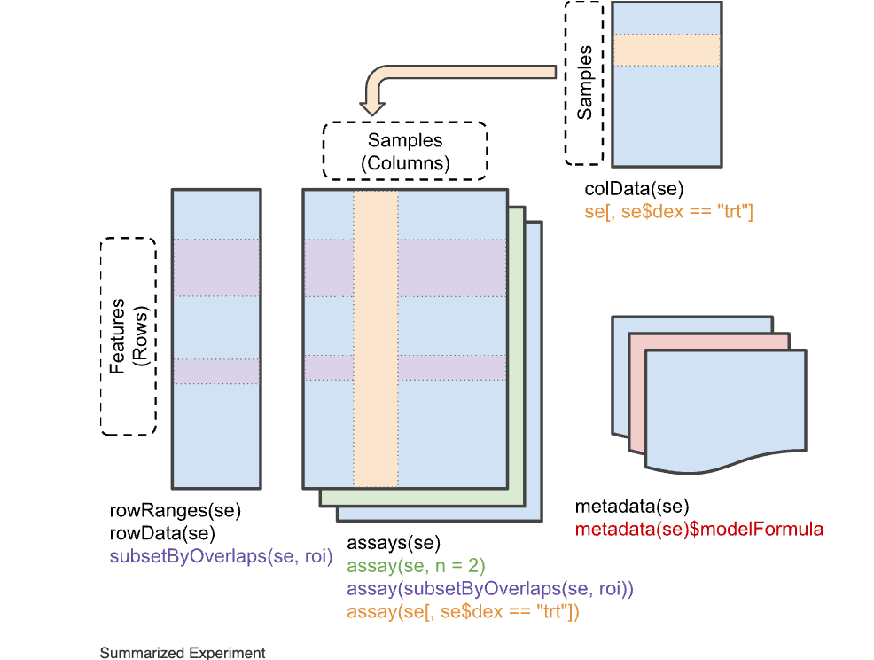
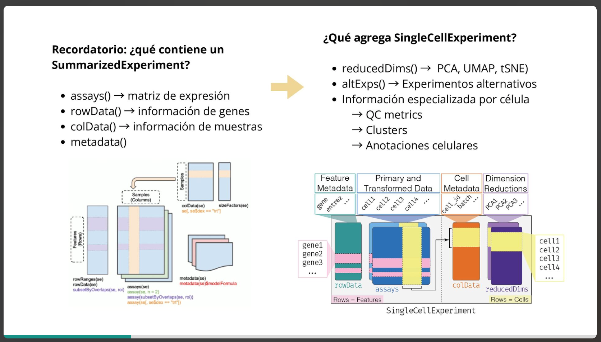
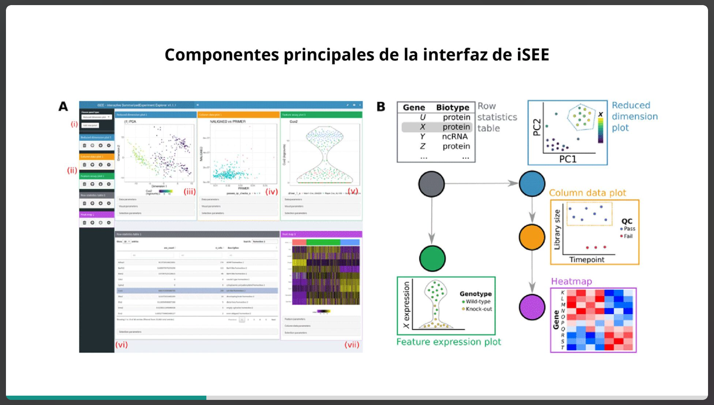

#3. OBJETOS DE BIOCONDUCTOR PARA DATOS DE EXPRESION

### SummarizedExperiment
autor: Martin Morgan

### ¿QUÉ ES?

`SummarizedExperiment` es una **clase contenedora** (un _data structure_) de Bioconductor para guardar datos de experimentos “rectangulares”:

- **Filas = features** (genes, transcritos, exones, picos, regiones, etc.)
- **Columnas = samples** (muestras, condiciones, réplicas, individuos)

 guarda **metadatos** de ambos lados (de las filas y de las columnas) de forma **sincronizada**.

> Each object stores observations of one or more samples, along with additional meta-data describing both the observations (features) and samples (phenotypes).

Ejemplos típicos de “experimental results”:
- **RNA-seq**: matriz de conteos (genes × muestras)
- **ChIP-seq**: matriz de conteos/coverage en picos (picos × muestras)
- **microarrays**: intensidades (probes × muestras)

- Esto es importante porque en análisis ómicos, un error común es “filtrar counts pero no filtrar los metadatos” (o viceversa). Eso rompe el mapeo “esta columna corresponde a esta muestra”, y puede llevar a resultados incorrectos.

####  `SummarizedExperiment` vs `RangedSummarizedExperiment`

#### A) `SummarizedExperiment` (clase “base”)

- Filas = features genéricas (genes, transcritos, etc.)
- La info de filas se guarda como una tabla tipo `DataFrame`
- Se accede con: **`rowData(se)`**

#### B) `RangedSummarizedExperiment` (hija)

Es un `SummarizedExperiment` pero pensado para datos donde cada feature corresponde a **coordenadas genómicas**.

- Filas = **rangos genómicos**
- Se guardan como **`GRanges`** o **`GRangesList`**
- Se accede con: **`rowRanges(se)`**

### CARACTERISTICAS ESPECIFICAS





#### `assays(se)` — los resultados experimentales (matrices)

- Es una **lista** de matrices con la _misma dimensión_.
- Ejemplos:
    
    - `counts`: matriz de conteos crudos (genes × muestras)
    - `logcounts`: conteos transformados
    - `TPM`, `CPM`, `normCounts`, etc.

Accesos típicos:

- `assays(se)$counts` (por nombre)
- `assay(se, 1)` (por índice; default es el primero)


> Puede tener múltiples assays, pero **todos deben corresponder a las mismas filas y columnas** (mismo set de features y samples).


#### Metadatos de filas: `rowData(se)` o `rowRanges(se)`

Depende de la clase:

- Si es `SummarizedExperiment`:
    
    - `rowData(se)` devuelve un `DataFrame` con atributos de features
    - Ejemplo de columnas: `gene_id`, `gene_name`, `biotype`, etc.

- Si es `RangedSummarizedExperiment`:
    
    - `rowRanges(se)` devuelve un `GRanges` o `GRangesList` con coordenadas
    - `GRangesList`: cada elemento es un transcrito y adentro hay exones.

**Cómo leer la salida de `GRanges`:**

- `seqnames`: cromosoma (chr1, X, etc.)
- `ranges`: intervalo (start-end)
- `strand`: + o -
- `mcols`: metadata por rango (ej. exon_id, exon_name)


> Para rangos genómicos, puedes hacer operaciones por intervalos (overlaps), que es lo que habilita funciones como `subsetByOverlaps()`.


### Metadatos de columnas: `colData(se)` (muestras)

Siempre es un `DataFrame` donde cada fila corresponde a **una columna** del assay.

- Ejemplos de variables:
    
    - condición (`dex`: trt/untrt)
    - batch (`Run`)
    - individuo/célula (`cell`)
    - covariables (sexo, edad, etc.)
        

Acceso
- `se$dex` es equivalente a `colData(se)$dex`

Esto permite subsetting por fenotipo:

```
se[, se$dex == "trt"]
```

- filtra **columnas** del assay
- filtra **filas** de `colData` para que queden esas muestras
- mantiene todo consistente


##### GenomicRanges

- guardar información en relación a coordenadas del genoma 

```R
gr <- GRanges( seqnames = Rle(c("chr1", "chr2", "chr1", "chr3"), c(1, 3, 2, 4)), ranges = IRanges(101:110, end = 111:120, names = head(letters, 10)), strand = Rle(strand(c("-", "+", "*", "+", "-")), c(1, 2, 2, 3, 2)), score = 1:10, GC = seq(1, 0, length=10)) 
gr
```


 Creación del primer objeto de SummarizedExperiment:

**`RangedSummarizedExperiment`** con:

- **1 assay**: `counts` (matriz 200×6)
- **rangos genómicos por gen**: `rowRanges` (un `GRanges` de 200 filas)
- **metadatos de muestras**: `colData` (6 filas)  
    y **todo coordinado** para que subsetting mantenga consistencia.
    

> nota:  aunque se  llama al constructor `SummarizedExperiment(...)`, al pasar `rowRanges=...` se obtiene  un **RangedSummarizedExperiment**.


```R

## Lets build our first SummarizedExperiment object
library("SummarizedExperiment")
## ?SummarizedExperiment

## De los ejemplos en la ayuda oficial

## Creamos los datos para nuestro objeto de tipo SummarizedExperiment
## para 200 genes a lo largo de 6 muestras
nrows <- 200 #tabla con informacion de gene s
ncols <- 6 #muestras 
## Números al azar de cuentas
set.seed(20210223)
counts <- matrix(runif(nrows * ncols, 1, 1e4), nrows) 
## Información de nuestros genes
rowRanges <- GRanges(
    rep(c("chr1", "chr2"), c(50, 150)),
	    #200 genes que empieen desde la posicion 100,000 hasta 1,000,000 todos tienes un tamaño de 100 bp 
    IRanges(floor(runif(200, 1e5, 1e6)), width = 100),
    
    strand = sample(c("+", "-"), 200, TRUE),
    #generacion de id de tres digitos 
    feature_id = sprintf("ID%03d", 1:200)
)
names(rowRanges) <- paste0("gene_", seq_len(length(rowRanges)))
## Información de nuestras muestras
colData <- DataFrame(
    Treatment = rep(c("ChIP", "Input"), 3),
    row.names = LETTERS[1:6]
)
## Juntamos ahora toda la información en un solo objeto de R
rse <- SummarizedExperiment(
    assays = SimpleList(counts = counts),  #matrix que hicimos 
    rowRanges = rowRanges, #les pasamos los nombres de los obejtos 
    colData = colData
)

## Exploremos el objeto resultante
rse
```

- `rowRanges(rse)` da un `GRanges` con:
    
    - `seqnames` (chr1/chr2)
    - `ranges` (start-end)
    - `strand` (+/-)
    - metadata: `feature_id`

- En un `RangedSummarizedExperiment`,`rowRanges()` reemplaza el rol de `rowData()` como “identidad genómica”.
- `rowData(rse)` existe, pero aquí es **solo la metadata asociada a esos rangos** (equivalente a `mcols(rowRanges(rse))`).

- `assays = SimpleList(counts = counts)`
    muestra resultados numéricos (p. ej. conteos de RNA-seq) con dimensión features×samples.

    - “¿Cuántos assays hay?” → `assayNames(rse)`
    - “¿Cómo saco la matriz?” → `assay(rse)` o `assays(rse)$counts`


#### COMANDOS MAS IMPORTANTES:

 **Tipo y resumen del objeto**
```
rse
```

Te dice clase, dims, assays, nombres de row/col, etc.

**Dimensiones**
```
dim(rse)
```

Debe coincidir con el tamaño del assay principal.

 **Nombres de filas/columnas**
```
dimnames(rse)
```

- filas = genes (`gene_1`, …)
- cols = muestras (`A`–`F`)

**Nombre(s) de assays**
```
assayNames(rse)
```

Aquí solo `"counts"`.

**Extraer datos**
```
head(assay(rse))

```

 **Extraer anotaciones**
```

rowRanges(rse)   # coordenadas genómicas (porque es ranged)  
colData(rse)     # metadata de muestras  
rowData(rse)     # metadata de features (mcols del GRanges)
```


### 3.2 Ejercicio

Explica que sucede en las siguientes líneas de código de R.

```
## Comando 1
rse[1:2, ]
```

> subset de **filas**, recorta **assay + rowRanges/rowData**, `colData` queda igual.

```
## class: RangedSummarizedExperiment 
## dim: 2 6 
## metadata(0):
## assays(1): counts
## rownames(2): gene_1 gene_2
## rowData names(1): feature_id
## colnames(6): A B ... E F
## colData names(1): Treatment
```

```
## Comando 2
rse[, c("A", "D", "F")]
```

> subset de **columnas**, recorta **assay + colData**, `rowRanges/rowData` queda igual.

```
## class: RangedSummarizedExperiment 
## dim: 200 3 
## metadata(0):
## assays(1): counts
## rownames(200): gene_1 gene_2 ... gene_199 gene_200
## rowData names(1): feature_id
## colnames(3): A D F
## colData names(1): Treatment
```


> colData servira como base para la creación de una model.matriz que se usa para análisis estadísticos en la expresión diferencial 


## iSEE: visualización interactiva

**iSEE** es un paquete de Bioconductor que crea una **interfaz interactiva (Shiny)** para **explorar** datos guardados en objetos tipo:

- `SummarizedExperiment`
- `SingleCellExperiment` (subclase para single-cell)


```
## Explora el objeto rse de forma interactiva
library("iSEE")
iSEE::iSEE(rse)
```

iSEE lee lo que ya está dentro del objeto:

- `assays(se)` → matrices (counts, logcounts, etc.)
- `colData(se)` → metadata de muestras/células
- `rowData(se)` → metadata de genes/features
- `reducedDims(se)` / `reducedDim(sce)` → PCA, t-SNE, UMAP (si existen)

Existen extensiones:

- `iSEEde`: resultados de expresión diferencial (p. ej. DESeq2)
- `iSEEpathways`: pathways
- `iSEEhub`: importar datasets de ExperimentHub u otras fuentes


> iSEE detecta automáticamente los componentes estándar de SummarizedExperiment y genera un UI interactivo multipanel para exploración.


#### Tipos de paneles

Dos ejes: **puntos = samples** o **puntos = features**.

**Paneles donde _cada punto es una muestra/célula_ (column-based)**

1. **Reduced dimension plot**
    
    - Usa `reducedDim(sce)` (PCA, tSNE, UMAP si existe).
    - Ejes = dos componentes (p.ej. PC1 vs PC2).
    - Puntos = células/muestras.
        
2. **Column data plot**
    
    - Grafica variables de `colData(se)` (QC, condición, tipo celular, etc.)
    - Tipo de gráfica depende de si x/y son categóricas o continuas:
        - continuo vs categórico → violin
        - continuo vs continuo → scatter
        - categórico vs categórico → “cuadritos” tipo Hinton (área ~ conteo)

3. **Column data table**
    
    - Tabla interactiva de `colData(se)`
    - Se usa mucho para **seleccionar muestras** y linkear a otros paneles.

4. **Feature assay plot**
    
    - “Expresión de un GEN (feature) a través de muestras”
    - y-axis = valores del assay para 1 gen (p.ej. logcounts)
    - x-axis = “None”, o una variable de colData, o incluso otro gen
    - La selección del gen se puede hacer desde una tabla de filas linkeada o tecleando el nombre.

---
 **Paneles donde _cada punto es un gen/feature_ (row-based)**

5. **Row data plot**
    
    - Grafica columnas de `rowData(se)` (p.ej. mean_log vs var_log)
    - Misma lógica de tipos de gráfica que column data plot.
        
6. **Row data table**
    
    - Tabla interactiva de `rowData(se)`
    - Sirve para elegir genes/features que alimentan otros paneles.
    - Puede “anotar al vuelo” con funciones de anotación (opcional, avanzado).

7. **Sample assay plot**
    
    - “Perfil de una MUESTRA específica a través de genes”
    - y-axis = valores del assay para 1 muestra (p.ej. logcounts de esa célula)
    - x-axis puede ser:
        
        - covariable de `rowData` (biotipo, etc.)
        - otro sample (comparación sample vs sample)
            

8. **Heat map (ComplexHeatmap)**

	- Matriz genes × muestras coloreada
	    
	- Selección de genes por:
	    
	    - lista manual (autocompletado)
	    - link desde row table/row plot
	    - pegar lista/archivo
	- Puede clusterizar (“Suggest feature order”)
	- Puede anotar columnas con `colData`


Paquete de bioconductor que permite la exploracion interactiva
- ISEE e suna herramienta que permite explorar datos de manera interactiva
ISEE esta construida sobre Shiny (framework de R para crear aplicaciones web interactivas)





![[Captura de pantalla 2026-02-11 a la(s) 13.08.33.png]]

 Reduce la dimension del plot:
	 cada punto = una celula (o muestra)
	 
paneles que se pueden conectar unos con otros 
