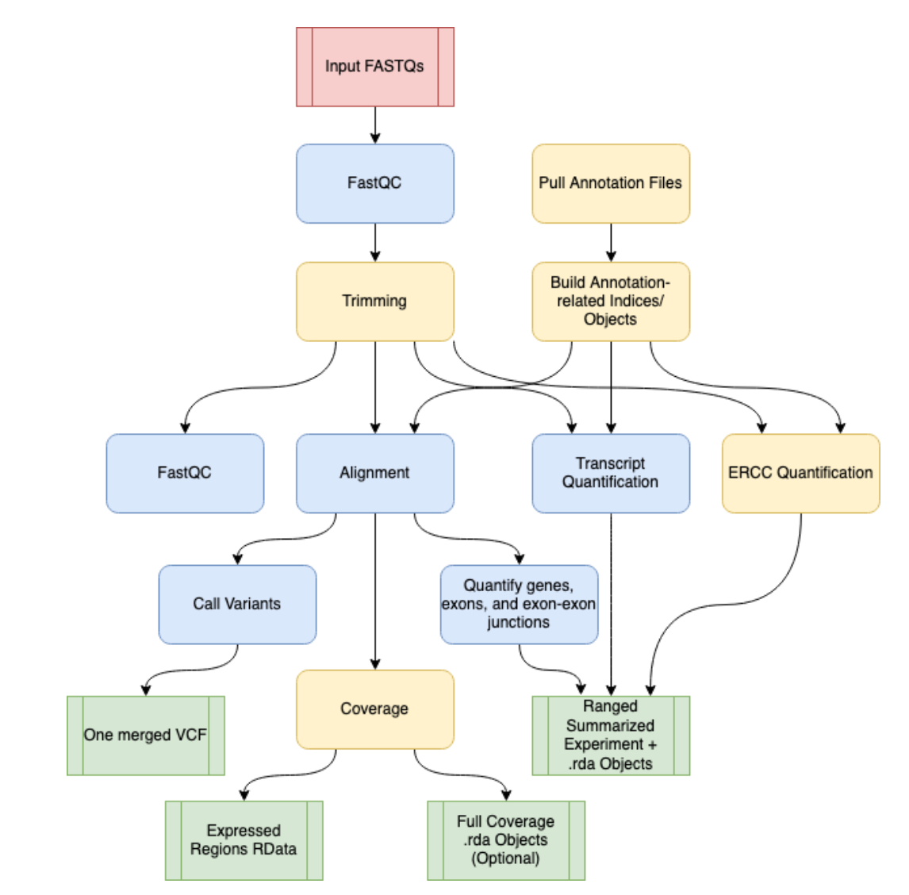
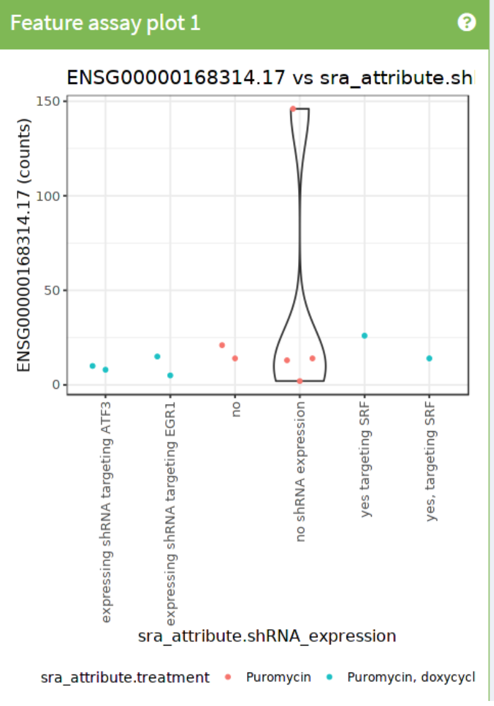
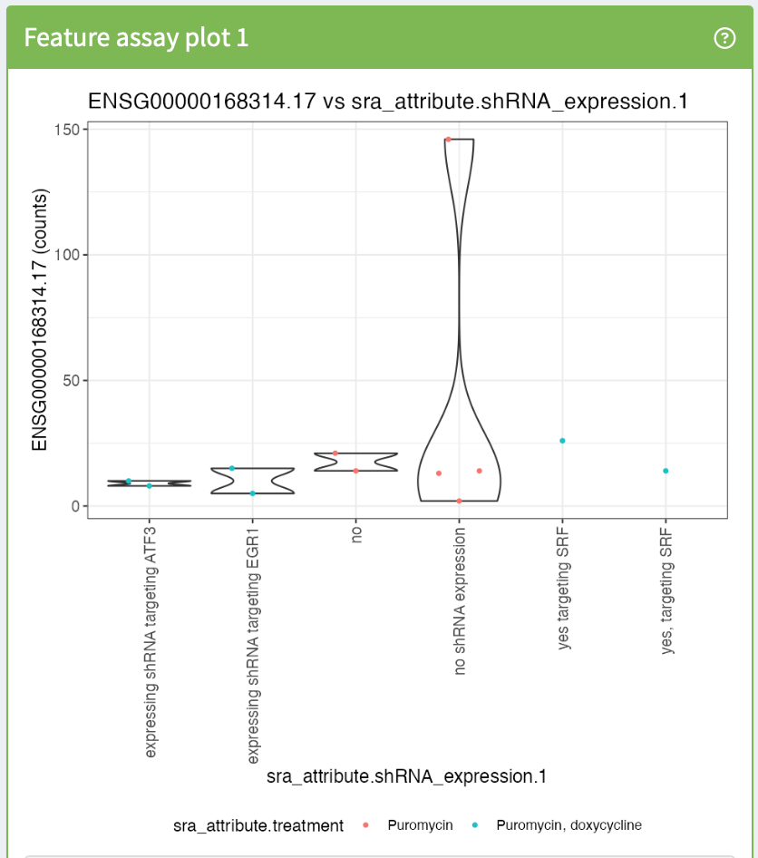
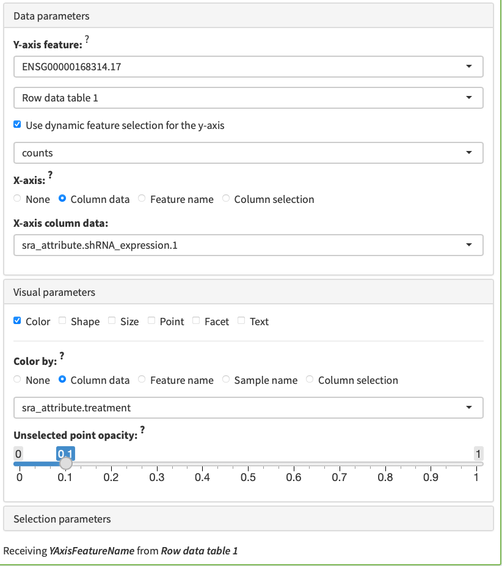

# 4. Datos de RNA-seq a través de recount3

### Procesar datos crudos (FASTQ) con SPEAQeasy

Cuando trabajamos con RNA-seq desde cero, el punto de partida son archivos **FASTQ**, que contienen las lecturas crudas generadas por el secuenciador. Para convertir estos datos en una matriz de cuentas por gen, necesitamos un pipeline de procesamiento.



### ¿Qué es SPEAQeasy?

**SPEAQeasy** es un pipeline automatizado para el procesamiento uniforme de datos de RNA-seq. Permite:

- Control de calidad (QC)
- Alineamiento a un genoma de referencia
- Cuantificación de expresión (genes, exones, etc.)
- Generación de objetos listos para análisis en R/Bioconductor

La idea central es estandarizar el procesamiento, evitando variabilidad técnica entre estudios.

```
FASTQ → QC → Alineamiento → Conteo → Objeto R (SummarizedExperiment)
```

El artículo principal (2021) describe el pipeline y su integración con herramientas modernas de análisis diferencial.

### Proyectos recount → recount3

### Evolución del recurso

1. **ReCount (2011)**  
    ~20 estudios procesados uniformemente.
2. **recount (2017)**  
    ~70,000 muestras de RNA-seq humano.
3. **recount3 (2021)**  
    ~700,000 muestras de humano y ratón.

### ¿Qué hace especial a recount3?

- Procesamiento uniforme de cientos de miles de muestras públicas (SRA, GTEx, TCGA).
- Acceso directo desde R.
- No necesitas HPC para descargar y analizar los datos.
- Democratiza el acceso a datos masivos de transcriptómica.

En lugar de descargar FASTQ y procesarlos tú mismo, puedes obtener directamente:

- Matrices de cuentas
- Metadatos completos
- Información de QC
- Anotaciones genómicas

###  Usar recount3 en R

### Paso 1: Cargar el paquete

```r
library("recount3")
```

Esto también carga automáticamente dependencias como `SummarizedExperiment`.


### Paso 2: Explorar proyectos disponibles

```r
human_projects <- available_projects()
```

Esto descarga la metadata de proyectos disponibles en humano.

Cada fila contiene:

- project (ej. SRP009615)
- tipo de proyecto
- fuente (SRA, GTEx, TCGA)
- organismo
- tipo de cuantificación disponible


### Paso 3: Seleccionar un estudio

Ejemplo:

```r
proj_info <- subset(  
    human_projects,  
    project == "SRP009615" & project_type == "data_sources"  
)
```

### Paso 4: Crear el objeto RSE

```r
rse_gene_SRP009615 <- create_rse(proj_info)
```

Esto descarga:

- Metadata del estudio
- Información de anotación
- Matriz de cuentas
- QC

Y construye un objeto:

```r
class: RangedSummarizedExperiment  
dim: 63856 genes × 12 muestras  
assays: raw_counts
```

### Transformación de cuentas

recount3 almacena cuentas por nucleótido.  
Para convertirlas a cuentas por lectura:

```r
assay(rse_gene_SRP009615, "counts") <-   
    compute_read_counts(rse_gene_SRP009615)
```

Otras transformaciones posibles:

- RPKM
- TPM
- log-transformaciones

### Expandir metadata experimental

Muchos atributos vienen codificados como texto. Podemos expandirlos:

```r
rse_gene_SRP009615 <- expand_sra_attributes(rse_gene_SRP009615)
```

Esto crea columnas adicionales en `colData()` como:

- tipo celular
- tratamiento
- condición experimental
- expresión de shRNA
- 
Esto es crucial para análisis diferencial.

###  Ejercicio

- Utiliza `iSEE` para reproducir la siguiente imagen


- Pistas:
    - Utiliza el _dynamic feature selection_
    - Utiliza información de las columnas para el eje X
    - Utiliza información de las columnas para los colores

**Resolución:**




